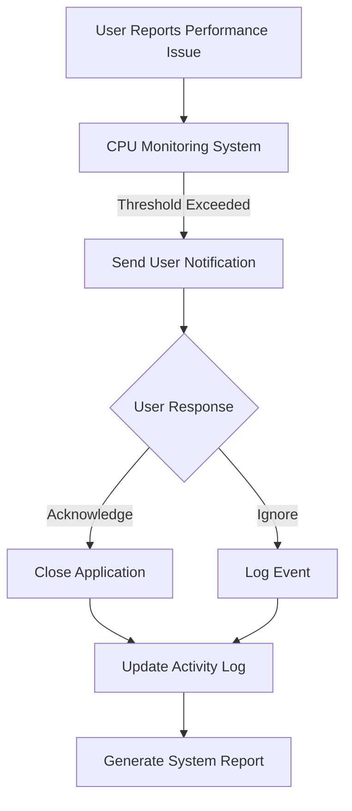

### Product Requirements Document: CPU Usage Monitor and Application Closure Tool

#### 1. Overview
This document outlines the requirements for an application designed to
monitor CPU usage on Mac OS devices and automatically close applications
when CPU usage exceeds a specified threshold.

#### 2. Objectives
- **Automate CPU Threshold Monitoring**: Identify running applications whose
CPU usage exceeds a predefined level.
- **Immediate or Delayed Closure**: Provide users with options to either
close applications immediately or after receiving a warning.
- **User Notifications**: Send alerts when potential closures are detected.
- **Customizable Settings**: Allow users to adjust the CPU threshold and
manage triggers for specific applications.

#### 3. Features

**Core Functionality**
- **CPU Usage Monitoring**: Continuously monitor CPU usage of running
applications.
- **Threshold Detection**: Identify when CPU usage exceeds a set threshold.
- **Application Closure**: Automatically close applications exceeding the
threshold, optionally after a warning.
- **Custom Triggers**: Allow users to specify which applications to monitor
and adjust thresholds as needed.

**User Interface**
- **Dashboard Overview**: Real-time visualization of CPU usage across
applications.
- **Control Buttons**: Options to increase or decrease the CPU threshold and
manage triggers.
- **Notification Alerts**: System-wide notifications for upcoming closures,
customizable in frequency and type.

#### 4. Technical Specifications

**Compatibility**
- Operates on macOS and compatible systems.

**APIs and Libraries**
- Uses NSAppleEvents for detecting running applications.
- Leverages Core Performance APIs to monitor CPU usage.

**Customization Options**
- **Selected Applications**: Users can choose which apps to monitor.
- **Threshold Adjustment**: Customizable levels of CPU usage deemed
excessive.
- **Closure Preferences**: Option to close or terminate applications
proactively.

#### 5. User Interface Design

**Dashboard Overview**
- Real-time graph showing current CPU usage across monitored applications.
- Color-coded indicators for thresholds (yellow for approaching, red for
exceeded).

**Control Panel**
- Sliders and buttons to adjust the CPU threshold dynamically.
- List of selected applications with options to add or remove from
monitoring.

**Notifications**
- Configurable alerts that can be sent via email, SMS, or in-app
notifications.
- Adjustable notification frequency based on user preference.

#### 6. Performance Metrics

**Success Metrics:**
- **Detection Accuracy**: Percentage of correct detection without false
positives.
- **User Satisfaction**: Reduction in perceived stress from reduced CPU load
during high usage periods.
- **Device Performance Impact**: Measured improvement in overall system
responsiveness after threshold is reached.

**Effectiveness Metrics:**
- **Resolution Speed**: Time taken to close applications once the threshold
is detected.
- **System Load Reduction**: Decrease in CPU utilization across all
processes post-closure.

#### 7. Additional Considerations

**Legal Compliance**
- Ensures privacy of user data, adhering to Apple's MDM policy for device
interaction.

**Integration**
- Potential integration with existing macOS security tools and performance
management software.

**Future Enhancements**
- **Application Prioritization**: Higher-priority applications can be given
preference in closing order.
- **Comprehensive Reports**: Detailed reports for auditing purposes.
- **Cross-Device Notifications**: Efficient notification handling across
various device types without overwhelming users.

### Conclusion
This application aims to enhance Mac OS performance by automating CPU
resource management, ensuring minimal disruption to user productivity while
providing flexibility through customizable settings and features.
