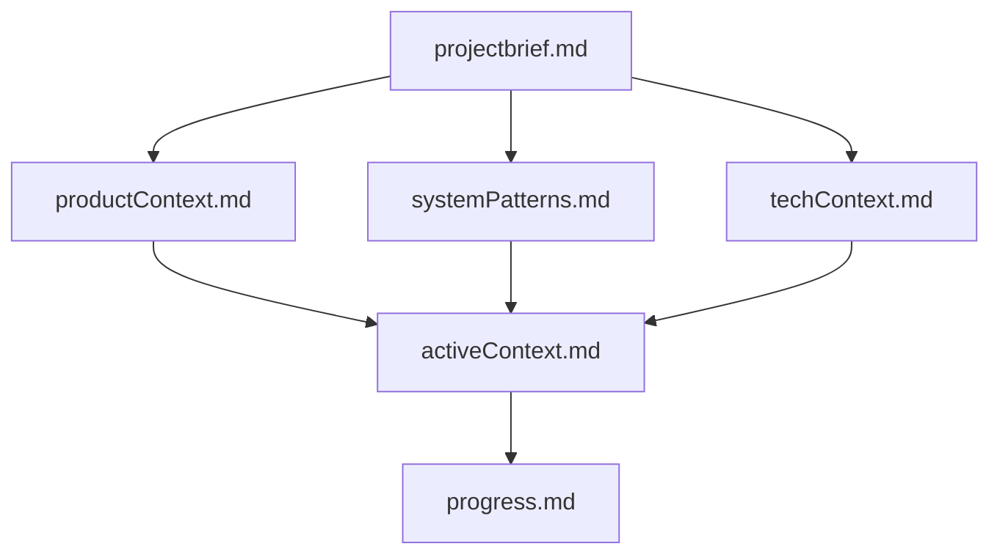

# ProjectBrief.md

### Overview of the Problem

Reducing CPU usage on Mac devices enhances productivity by preventing
applications from becoming laggy or unresponsive. High CPU utilization can
lead to performance issues such as slow app launches, reduced
responsiveness, and a poor user experience.

### Solution Objectives

- **Reduce Lag**: Implement efficient monitoring to prevent apps from
becoming laggy.
- **Enhance Productivity**: Provide insights into CPU usage for better task
management.
- **User-Friendly**: Offer clear notifications and customizable settings for
users.

### Key Features

1. **CPU Usage Monitoring**:
   - Utilizes macOS APIs (e.g., `NSAppleEvents`, `CorePerformance`) for
accurate monitoring.

2. **Customizable Notifications**:
   - Offers user-friendly alerts through system messages or app center.
   - Allows setting CPU thresholds, trigger actions (shut down apps, force
restart), and sensitivity.

3. **Cross-Platform Compatibility**:
   - Supports future expansion to iOS if needed.

4. **Efficient Networking**:
   - Uses Swift framework details for efficient data handling over network
APIs.

5. **Legal Compliance**:
   - Adheres to regulations like GDPR, CCPA, and FCA to ensure user trust
and data protection.

6. **Integration**:
   - Integrates with macOS services (e.g., App Center) for centralized
management.

7. **Performance Considerations**:
   - Focuses on optimizing app performance while maintaining responsiveness.

8. **Security Measures**:
   - Implements measures like encryption to protect user data and prevent
rate limiting issues.

9. **Future Vision**:
   - Expands monitoring capabilities across multiple devices.
   - Enhances integration with other macOS services for a comprehensive
solution.

### Core Technologies

- **macOS APIs**: `NSAppleEvents`, `CorePerformance` for detailed CPU
metrics.
- **Development Framework**: Swift for robust and efficient development.
- **Networking**: Efficient network APIs like the `Networking` framework or
SwiftNet.
- **Database**: Lightweight database for storing usage patterns and user
preferences.

### Performance Metrics

- CPU utilization tracking for active applications.
- Real-time notifications based on configurable thresholds.
- Detailed logs for monitoring app performance over time.

### Legal Compliance

- Adherence to GDPR, CCPA, and FCA regulations to ensure user trust and data
protection.

### Integration

- Seamless integration with macOS services like App Center or system
messages for a comprehensive user experience.

### Future Enhancements

- Expanded monitoring across multiple devices.
- Enhanced integration with other macOS services for a holistic solution
approach.
