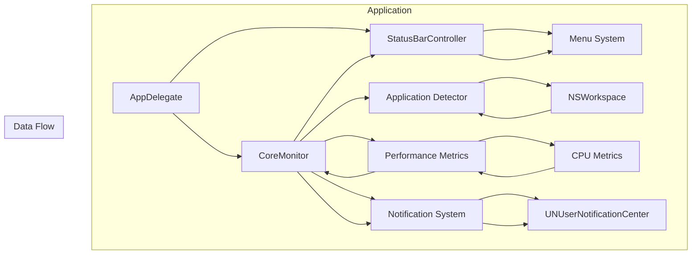

# SystemPatterns.md

### Development Mode Patterns

1. **Dependency Injection**:
   - Core components injected into CoreMonitor
   - Protocols define clear interfaces
   - Mock implementations for testing
   - Development-mode notification system

2. **Observer Pattern**:
   - Combine framework with throttling
   - Publisher/Subscriber for CPU metrics
   - Menu updates via data binding
   - Smart update detection

3. **Singleton Pattern**:
   - CoreMonitor shared instance
   - Retained status bar controller
   - Global instance management
   - Memory-efficient lifecycle

4. **Protocol-Oriented Design**:
   - ApplicationDetector with throttling
   - PerformanceMetrics with mocks
   - NotificationSystem with development mode
   - Clean interface boundaries

### Core Technologies

1. **macOS Integration**:
   - NSWorkspace with optimized polling
   - AppKit with retained components
   - Custom notification system
   - Efficient event loop

2. **Swift Features**:
   - Combine with throttling
   - Protocol-oriented architecture
   - Property wrappers for state
   - Modern concurrency patterns
   - Autorelease pool optimization

3. **System Integration**:
   - Status bar presence
   - Bundle management
   - System notifications

### Development Mode Considerations

1. **Modularity**:
   - Independent components
   - Clear protocol boundaries
   - Testable architecture
   - Development mode isolation

2. **Extensibility**:
   - Plugin-ready design
   - Configurable thresholds
   - Customizable notifications
   - Mode-specific implementations

3. **Performance**:
   - Smart throttling system
   - Efficient event processing
   - Resource management
   - Memory optimization

4. **User Experience**:
   - Non-intrusive UI
   - Detailed app usage
   - Clear feedback
   - Development mode indicators

### Application Lifecycle

1. **Initialization**:
   - Retained instance setup
   - Component initialization
   - Development mode configuration
   - Event loop preparation

2. **Runtime**:
   - Throttled monitoring
   - Smart UI updates
   - Efficient notification delivery
   - Resource-aware processing

3. **Termination**:
   - Resource cleanup
   - State persistence
   - Graceful shutdown
   - Memory management
