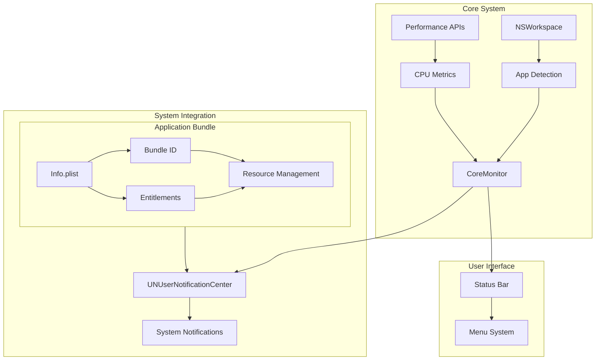

# TechContext.md


### Development Mode Architecture

1. **Application Structure**:
   - Pure Swift implementation without bundle dependencies
   - Event-driven architecture with optimized loop
   - Retained instance management
   - Resource-aware build configuration

2. **System Integration**:
   - AppKit-based menu bar integration
   - Custom notification system
   - Throttled event processing
   - Efficient resource management

### Technology Stack

1. **Core Framework**:
   - Swift 5.5+ with modern concurrency
   - macOS 12.0+ optimizations
   - Combine for reactive updates
   - AppKit for native UI
   - Memory-efficient autorelease pools

2. **System Integration**:
   - NSWorkspace for monitoring
   - UserNotifications framework
   - AppKit for UI
   - Bundle resources

### Development Requirements

1. **Build System**:
   - Swift Package Manager
   - macOS 12.0+ SDK
   - Command line tools
   - Framework linking configuration

2. **Dependencies**:
   - Foundation
   - AppKit
   - Combine
   - UserNotifications

### Development Mode Implementation

1. **Application Flow**:
   ```
   CoreGuard/
   ├── Sources/
   │   ├── App/
   │   │   ├── main.swift (event loop)
   │   │   └── AppDelegate.swift
   │   ├── Core/
   │   │   ├── CoreMonitor.swift (throttled)
   │   │   └── ApplicationMetric.swift
   │   └── UI/
   │       └── StatusBarController.swift
   ```

2. **Performance Optimizations**:
   - Throttled notifications (5s interval)
   - Smart event loop timing
   - Efficient memory management
   - Retained instance lifecycle

3. **Resource Management**:
   - Excluded bundle resources
   - Clean build configuration
   - Framework dependencies
   - Development-mode assets
